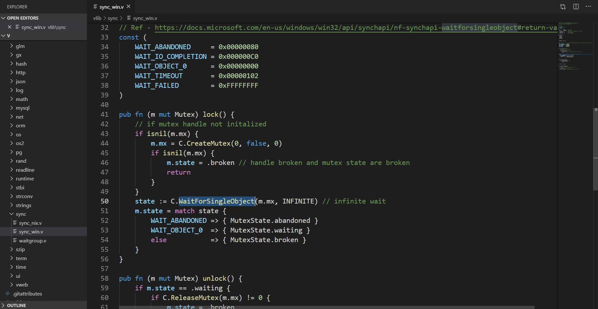
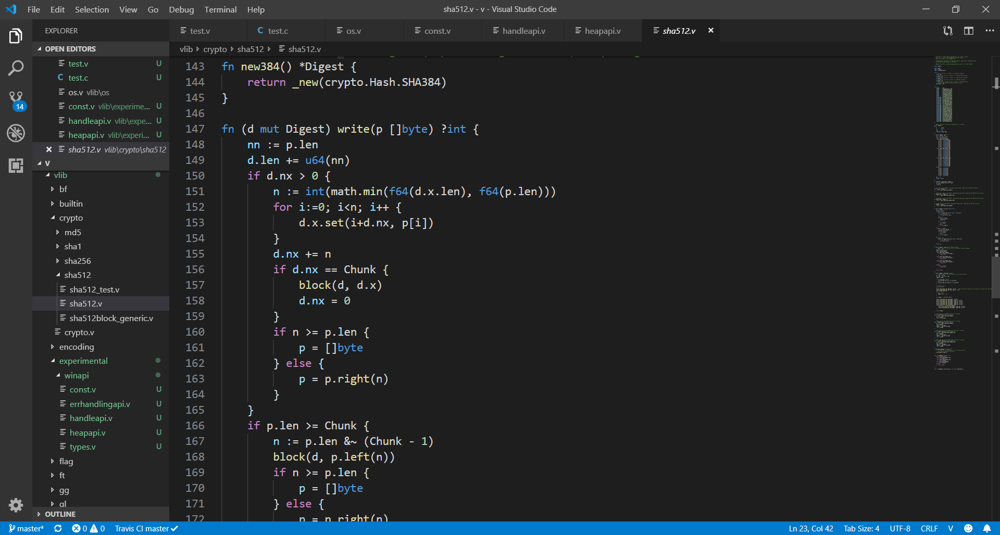

# V for Visual Studio Code

[**V Language**](https://vlang.io) support extension for Visual Studio Code. Syntax highlighting and code snippets.
https://marketplace.visualstudio.com/items?itemName=0x9ef.vscode-vlang&ssr=false

## Features
* Code snippets
* Syntax highlighting 
  
## In progress
* IntelliSense
* Code diagnostic
* Code testing
* Hot commands

## Preview

## License
[MIT](./LICENSE)
