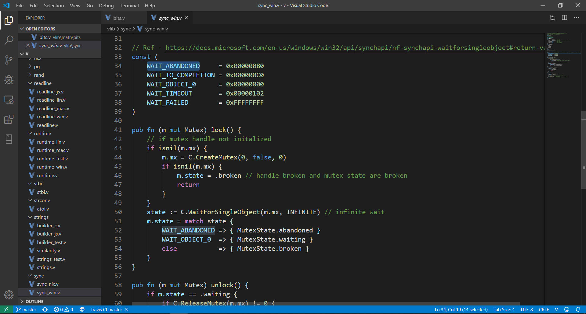

# V language support for Visual Studio Code

Provides [V language](https://vlang.io) support for Visual Studio Code.

## Preview

## Features

### Code Editing

- syntax highlighting
- code snippets for quick coding

### Others

- upload to the DevBits V playground.

## Usage

First you will need to install [Visual Studio Code][vs-code] >= `1.40`.
In the command palette (`Cmd+Shift+P`) select `Install Extensions` and choose `V`.
Alternatively you can install the extension from the [Marketplace][market-ext-link].
Now open any `.v`, `.vsh`, `.vv` file in VS Code.

_Note_: It is recommended to turn `Auto Save` on
    in Visual Studio Code (`File -> Auto Save`) when using this extension.

## Commands

- `V: Run current file`
- `V: Build an optimized executable from current file`
- `V: Show V version`
- `V: Upload and share current code to V playground`
- `V: Update VLS`
- `V: Restart VLS`

You can access all of the above commands from the command palette (`Cmd+Shift+P`).

## License

[MIT](./LICENSE)

<!-- Links -->
[vs-code]: https://code.visualstudio.com/
[market-ext-link]: https://marketplace.visualstudio.com/items?itemName=vlanguage.vscode-vlang
