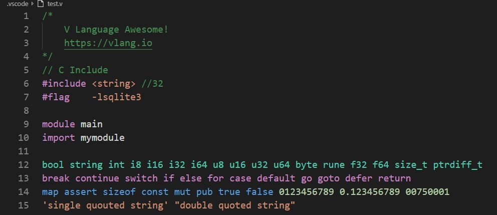
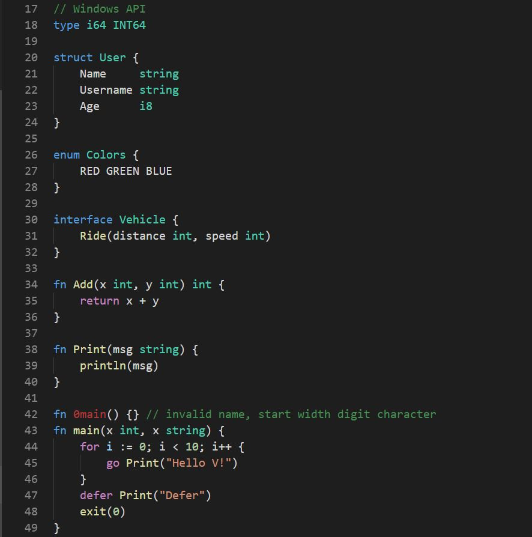
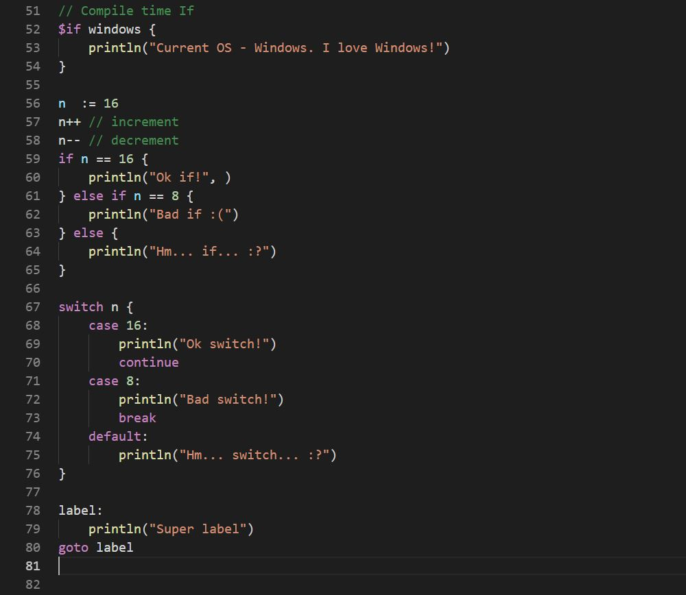

# V for Visual Studio Code

**V Language** support extension for Visual Studio Code. Syntax highlighting and code snippets.
https://marketplace.visualstudio.com/items?itemName=0x9ef.vscode-vlang&ssr=false

## Features
* Code snippets
* Syntax highlighting 

## Implemented
* Single line, multiline comment
* Function definition (`fn myFunc(x int, y int)`, `go myFunc(1, 2)`)
* Extra keywords (`#include`, `#flag`, `module`, `package`)
* Types keywords (`bool`, `string`, `int`, `size_t` etc...)
* Control `if`, `else if`, `else`
* Compile time `$if` (`$if windows {}`)
* Deferencing function (`defer myFunc(1, 2)`)
* Control keywords (`for`, `break`, `continue`, etc..)
* Storage keywords, storage modifyers (`enum`, `struct`, `const`, `pub`, `mut`, etc...) 
* Language contants (`true`, `false`)
* Single/Double Quoted strings (`""`, `''`)
* Integer, float, hex (`-100/100`, `-100.000/100.000`, `0x9ef`)
  
## In progress
* IntelliSense
* Code diagnostic
* Code testing
* Hot commands

## Preview

## License
[MIT](./LICENSE)
