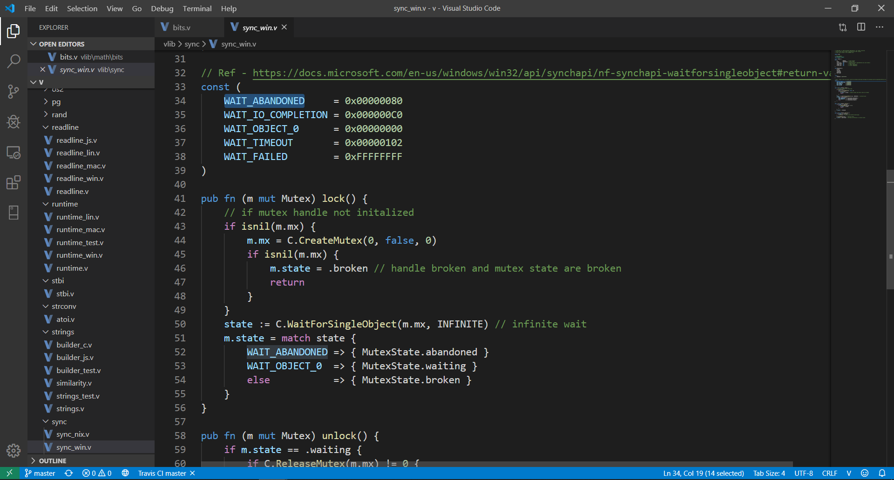

# V language support for Visual Studio Code

Provides [V language](https://vlang.io) support for Visual Studio Code.

## Preview

## Features

### Code Editing

- syntax highlighting
- code snippets for quick coding
- completion, diagnostics, navigation, inlay hints, and other language
  features via VLS

### V Language Server

Install [VLS](https://github.com/vlang/vls) and ensure the `vls`
executable is in PATH. Alternatively, set `v.vls.command` to its
absolute path. The extension starts VLS over stdio when a V workspace
is opened.

The available VLS settings are:

- `v.vls.enable`: enable or disable VLS
- `v.vls.command`: path or command name for the VLS executable
- `v.vls.args`: additional command-line arguments
- `v.vls.inlayHints.enabled`: enable or disable inlay hints
- `v.vls.diagnostics`: enable or disable live diagnostics

## Usage

First you will need to install [Visual Studio Code][vs-code] >= `1.105`.
In the command palette (`Cmd+Shift+P`) select `Install Extensions` and choose `V`.
Alternatively you can install the extension from the [Marketplace][market-ext-link].
Now open any `.v`, `.vsh`, `.vv` file in VS Code.

_Note_: It is recommended to turn `Auto Save` on
in Visual Studio Code (`File -> Auto Save`) when using this extension.

## Commands

- `V: Run current file`
- `V: Format current file`
- `V: Build an optimized executable from current file`
- `V: Show V version`
- `V: Update VLS`
- `V: Restart VLS`

You can access all of the above commands from the command palette (`Cmd+Shift+P`).

## Debug the extension

Clone this repository and run `npm install` to install the dependencies.
Then press `F5` to open a new VS Code window with the extension loaded.

Open the output console (`Cmd+Shift+U`) to see the debug output from the extension.

Run `Cmd+Shift+P` and select `Preferences: Open User Settings` to update settings.

## License

[MIT](./LICENSE)

<!-- Links -->

[vs-code]: https://code.visualstudio.com/
[market-ext-link]: https://marketplace.visualstudio.com/items?itemName=vlanguage.vscode-vlang
