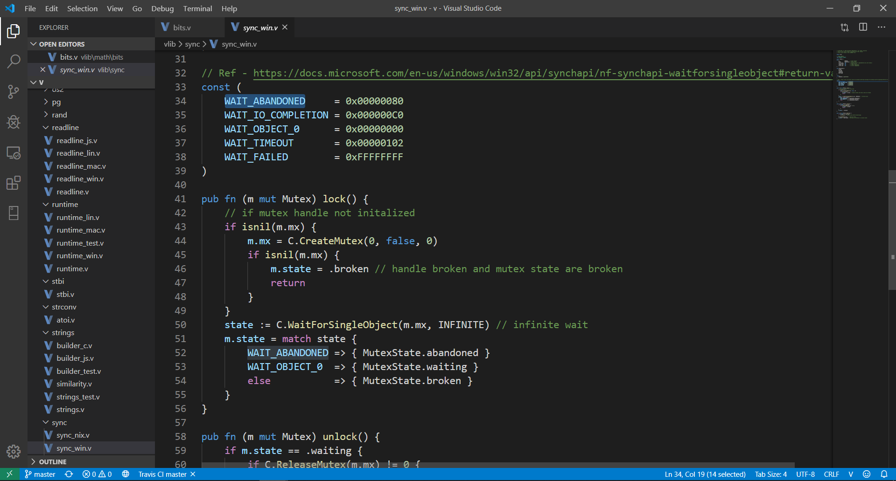

# V language support for Visual Studio Code

Provides [V language](https://vlang.io) support for Visual Studio Code.

## Preview

## Features

### Code Editing

- syntax highlighting
- code snippets for quick coding
- completion, diagnostics, navigation, inlay hints, and other language
  features via VLS
- runnable CodeLens actions for `main` and tests
- workspace build, run, and test tasks
- test coverage highlighting and a status bar summary

### V Language Server

Install [VLS](https://github.com/vlang/vls) and ensure the `vls`
executable is in PATH. Alternatively, set `v.vls.command` to its
absolute path. The extension starts VLS over stdio when a V workspace
is opened.

The available VLS settings are:

- `v.vls.enable`: enable or disable VLS
- `v.vls.command`: path or command name for the VLS executable
- `v.vls.args`: additional command-line arguments
- `v.vls.inlayHints.enabled`: enable or disable inlay hints
- `v.vls.diagnostics`: enable or disable live diagnostics
- `v.vls.coverage.enabled`: collect coverage during test tasks and highlight
  covered and uncovered executable lines
- `v.executablePath`: V compiler used by VLS and tasks; supports absolute
  paths, `~`, `${env:NAME}`, and `${workspaceFolder}`

Settings from the former VLS extension (`vls.command`, `vls.args`,
`vls.vCommand`, and its inlay hint, diagnostics, and coverage toggles) remain
effective until replaced by the corresponding `v.*` settings.

### Build, run, and test

Use `V: Build`, `V: Run`, or `V: Test` in the Command Palette, or select a V
task from `Tasks: Run Task`. Build, Run, and Test operate on the workspace;
Run uses the active V module or script when one is open, and Test uses the
active `_test.v` file. The extension saves modified V files in the target
before running.

`V: Run current file` uses the same run task. For a `.v` file, it runs the
containing module; for a `.vsh` file, it runs the script.

VLS CodeLens actions such as `Run Main`, `Run File`, and `Run Test` use the
same tasks. Test runs collect coverage by default. Covered executable lines
are highlighted green and uncovered lines red. Click the coverage status
item or run `V: Clear Test Coverage` to remove the highlights.

To create a test file from a source file, run **V: Generate Test File**. It
creates the `_test.v` file beside the source with one `test_` function per public
function, each with a placeholder assertion to replace. It refuses to overwrite
an existing test file.

## Usage

First you will need to install [Visual Studio Code][vs-code] >= `1.105`.
In the command palette (`Cmd+Shift+P`) select `Install Extensions` and choose `V`.
Alternatively you can install the extension from the [Marketplace][market-ext-link].
Now open any `.v`, `.vsh`, `.vh`, or `.vv` file in VS Code.

_Note_: It is recommended to turn `Auto Save` on
in Visual Studio Code (`File -> Auto Save`) when using this extension.

## Commands

- `V: Run current file`
- `V: Format current file`
- `V: Build an optimized executable from current file`
- `V: Generate Test File`
- `V: Show V version`
- `V: Update VLS`
- `V: Restart VLS`
- `V: Build`, `V: Run`, and `V: Test`
- `V: Clear Test Coverage`

You can access all of the above commands from the command palette (`Cmd+Shift+P`).

## Debug the extension

Clone this repository and run `npm install` to install the dependencies.
Then press `F5` to open a new VS Code window with the extension loaded.

Open the output console (`Cmd+Shift+U`) to see the debug output from the extension.

Run `Cmd+Shift+P` and select `Preferences: Open User Settings` to update settings.

Run `npm test` for logic checks and `npm run test:vscode` for an extension-host
check. The latter uses `~/code/vls/vls` and `~/code/v/v` by default and downloads
a local VS Code test build if `CODE_EXECUTABLE` is unset. Set `VLS_BINARY` and
`V_BINARY` to use other binaries. After `npm run package`, set
`TEST_PACKAGED=1` when running `npm run test:vscode` to install and test the
VSIX in an isolated VS Code profile.

## Debugging

V programs can be debugged from the Run and Debug view. The extension contributes
a `type: "v"` debugger: it compiles the program with `-g`, then hands the
session to the C/C++ extension's `cppdbg` adapter, which requires both
`ms-vscode.cpptools` and `gdb` on PATH. A missing piece shows an install
hint instead of failing silently.

A default launch configuration is provided, so starting a debug session does not
require writing a `launch.json` by hand. The `program` field is the V source file
to debug; `args`, `stopAtEntry` and `cwd` are optional. `miDebuggerPath` names
the MI debugger (a path or a command on PATH, with `~` expanded) and `MIMode`
selects `gdb` or `lldb`; both default to gdb on PATH, which is what unblocks
macOS debugging where gdb is effectively unavailable. `setupCommands` passes
extra MI commands through after the printer setup, `environment` and `envFile`
set the program environment, and `externalConsole` runs it outside the
integrated terminal. See `docs/TROUBLESHOOTING-DEBUGGING.md` when a session
misbehaves.

Attach works the same way with `"request": "attach"`: `program` names the
running binary for symbols (nothing is compiled), `processId` takes a PID
or `${command:pickProcess}` for the adapter's picker, and `sourceFileMap`,
`miDebuggerServerAddress` and `pipeTransport` reach remote targets.

Each session loads GDB pretty printers for V values: strings show as text,
`Option` and `Result` show their payload, and arrays and maps summarize
their lengths. This needs a GDB with Python support; without it the session
still runs, only without the pretty display.

## License

The extension is distributed under [GPL-2.0-only](./LICENSE) because its
task and coverage implementation comes from the VLS VS Code extension.
Existing files covered by the [MIT license](./LICENSE.MIT) retain that license.

<!-- Links -->

[vs-code]: https://code.visualstudio.com/
[market-ext-link]: https://marketplace.visualstudio.com/items?itemName=vlanguage.vscode-vlang
